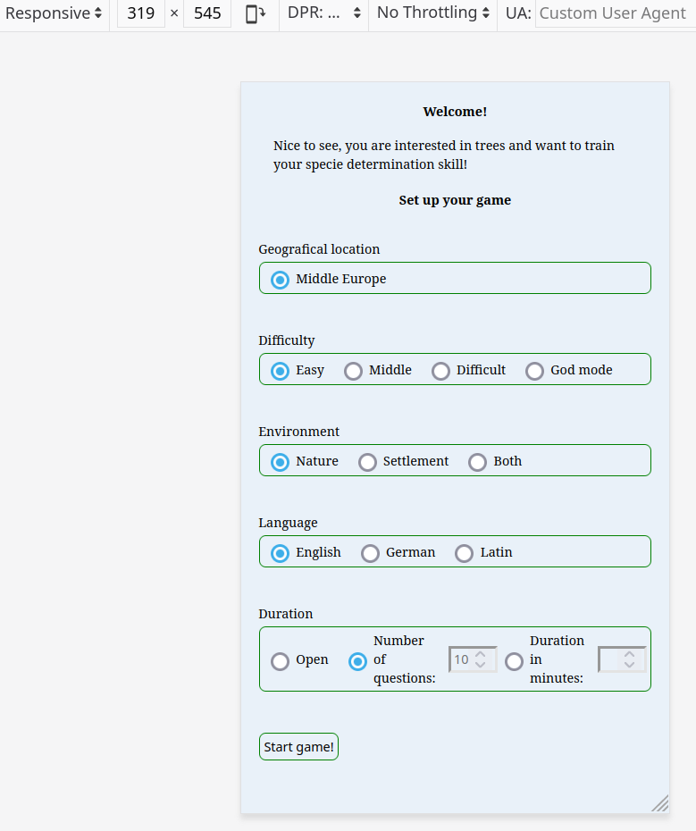
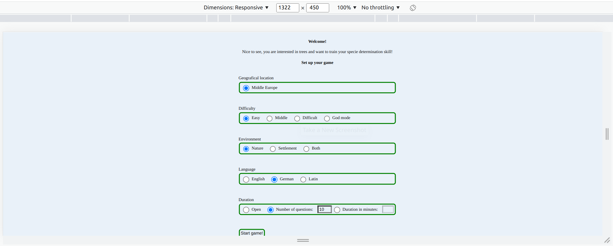
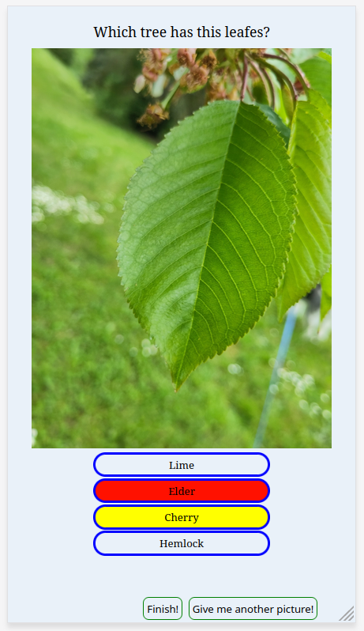
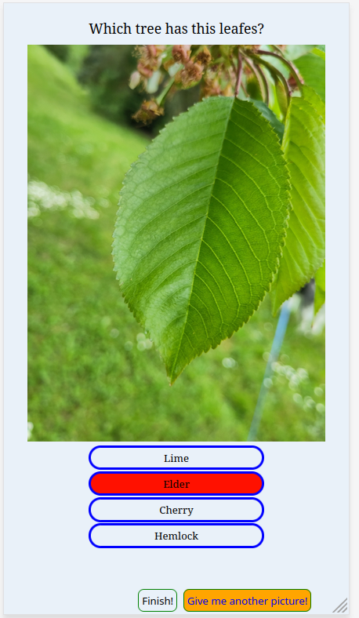
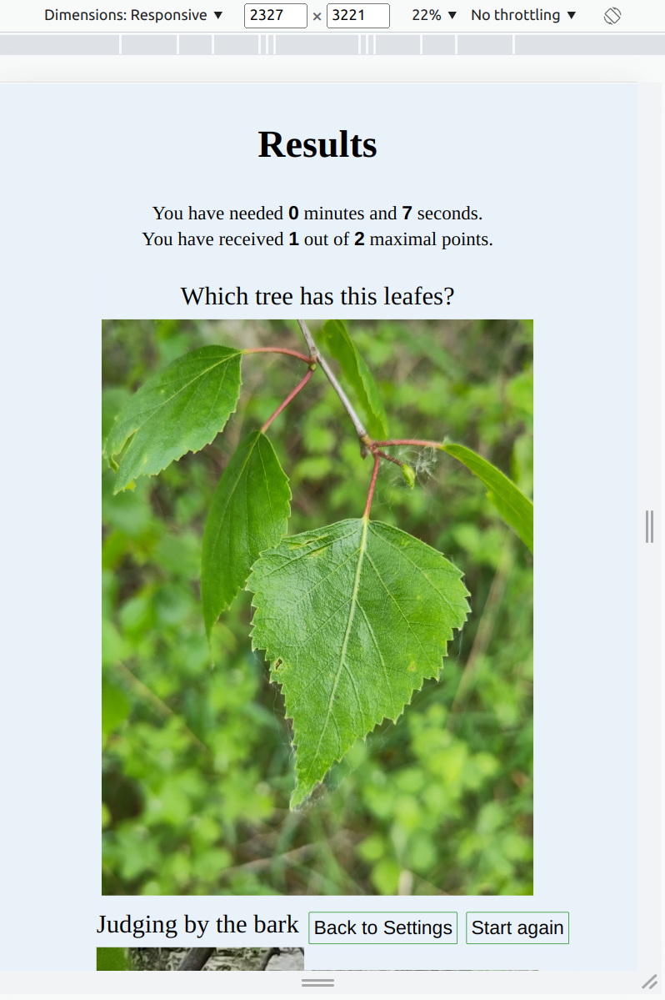
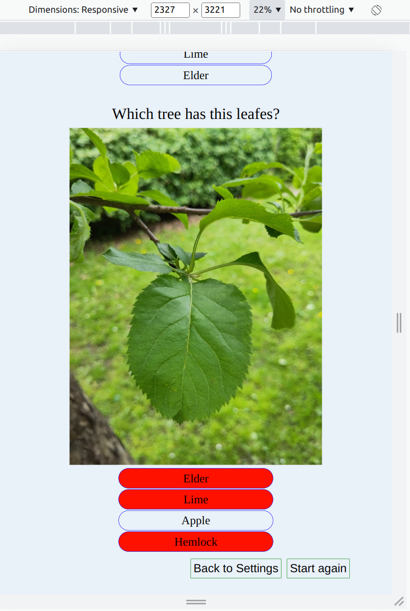
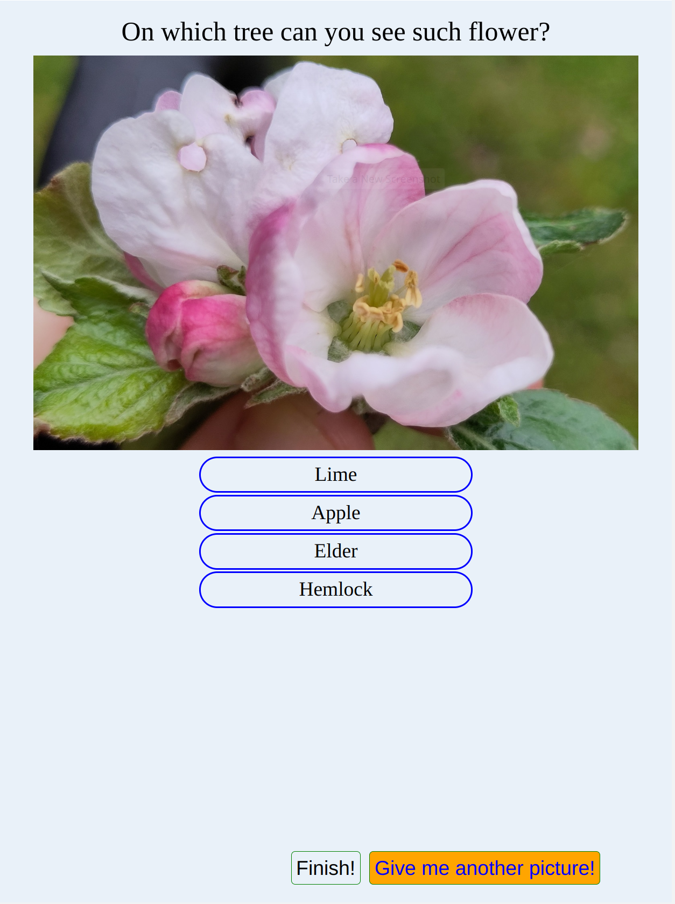
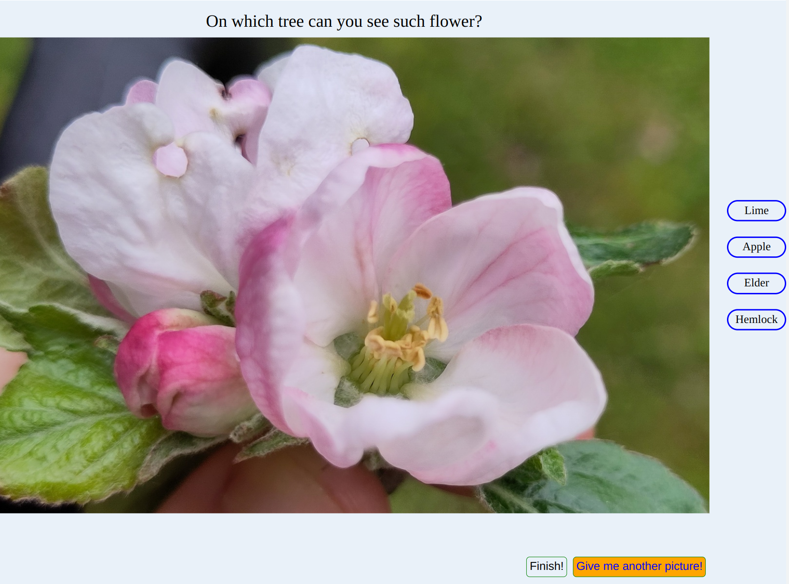

|  | [QR-Code to page](docu/qrcode_guest2111.github.io.png) | [link to github pages](https://guest2111.github.io/quiz_of_trees/index.html) |
---

Hello,
the idea of this project to train one's tree determination skill in the way of a quiz.

 * [User Experience](#user-experience)
   * [User Stories](#user-stories)
 
 * [Design](#design)
   * [Design of Settings page](#degin-of-settings-page)
   * [Design of Game page](#deign-of-game-page)
 
 * [Features](#features)
   * [Settings](#settings)
   * [Game Play](#game-play)
   * [Accessibility](#accessibility)
   * [Future Implementations](#future-implementations)
 
 * [Technologies Used](#technologies-used)
 
 * [Deployment & Local Development)](#deployment-local-development)
   * [Installation by user](#installation-by-user)
   * [Deployment](#deployment)
   * [Local Development](#local-development)
   * [How to add Images to Database](#how-to-add-images-to-database)
   * [Sharing](#sharing)
 
 * [Testing](#testing)
   * [Validator tests](#validator-tests)
     * [WC3](#wc3)
     * [Wave](#wave)
     * [Jigsaw](#jigsaw)
     * [Lighthouse](#lighthouse)
   * [User tests](#user-tests)
   * [Bugs](#nugs)
   * [Open Bugs](#open-bugs)
   * [Fixed Bugs](#fixed-bugs)
 
 * [Credits](#credits)
   * [Code Used](#code-used)
   * [Content](#content)
   * [Media](#media)

---

# User Experience
## Main purpose
The main goal of this project is to support peoples **awareness** for nature. One way of doing so is knowledge and one key point for knowledge is to recognise different species.
## User Stories
The user seeks to train his tree specie determination skills and wants to do it on a fun way without having issues of how to use the software or webpage. It must be possible to not change any setting and start a short game. He wants to be able to recoqnise species while walking around in his neighbourhood or while visit another area. 

It would be helpful to the user to use the app whenever conveniant. On desktop pc at home for big and nice pictures as well as on commuting on a mobile device.

This is not a simple task. Especially in winter there are not many hints visible to recoqnise a tree specie. Flowers and leaves have their own time and can not used for determination whole year around. Even the bark looks different on old and young trees.

The evaluation of the game play is set up rather benevolent. Even after answering wrong one can still receive a fraction of points for the answer. Only if out of two left possible answers the wrong one is choosen, then no point is given for the question. By that just by mathematical probability it is likely to receive more than half of the points. This should ensure the user to continue playing and training his skills since it feels like success.

**But the user must have interest in trees!** Otherwise he will not have fun with the game.

----

# Design
The design is build up to simplistic and without many visible features and decorations.
Most size properties are related to the available space to fit on different devices.

## Design of Settings page
Around a screen width of `300px` the settings page becomes diffucult to use on the number inputs for duration or number of questions. But so small screens are rare nowadays and mobile devices usually offer a separate input field. The design of input groups breaks on a bit more narrow screens. Starting the game is still possible. 

On wide screens with low height there appears a similar issue. The start button goes below the lower edge. But the page is scrollable and one can still reach the button.

## Design of Game page
The game page is build to have visually separate inputs. The positioning and the border of the answer options and the command options are different as well as the hover event on deskopt devices. That should make it intuitive for the user that the usage of both is different.

 

The evaltion page is the first page, where scrolling is necessary. Since all history is displayed:

[evaluation (careful: it is a very high picture)](docu/evaluation.png)

On normal screen ratios the lower command line is not so much displaced:

Picture can have very different ratios since they are supposed to show mainly one criteria. Otherwise it might be a combination of criterias on one picture for example leafes next to the bark. Leafes are typically easy to recoqnise and bark is diffult. For this different ratios make the dimensioning of the page difficult.
For most pictures the page border should not be touched by any visual element and the visual elements should not overlap each other (except for the evaltion as mentioned before).

----

# Features

## Settings

Settings influence game play: which pictures and questions are shown

### Languages
- it is possible to change the language of the species in the answers to: English, German, Latin
- page translation works only for one language at a time -> if you want to try, keep the answers to English

### Duration
You can set up how long the end lasts:
- Open / No given end 
  - only possibility is to hit the end button
  - points for last question can not be obtained hence it is a malus to the users score

### Geografical location
- for now there are pictures taken only in Germany
- no other regions possible

### Difficulty
- not implemented yet

### Envirionment
- not implemented yet

## Game Play

## Accessibility

Since it is only about a pictures it is impossible to provide helpful informtion to blind people. People might use screen readers connected to the mouse.
For smartphones  it is not possible to have a mouse hoover event which lets read the options.
Maybe for this case it would be usefule to make a `<ol>` for the answer buttons for better access.

## Future Implementations

### Geografical location
- requires a much bigger database in particular at least same amount of another region

### Difficulty
- intended to not show difficult species or pictures if easy mode selected
- list preferable some similar answers if difficult
- don't allow requesting another picture if God Mode
- first choice must be correct to optain answer if on a difficult mode
- most of this **require more pictures** in the database

### Envirionment
- option 'Nature': selecting to show pictures, which are normally growing in the area
- option 'Settlement': showing plants which are usually planted in parks, town streets and gardens
- option 'Both': regardless of inside or outside of settlement
- most of this **require more pictures** in the database

### Hoover for mobile devices
- [Giving a hoover alternative for mobile devices](https://www.prowebdesign.ro/how-to-deal-with-hover-on-touch-screen-devices/)

----

# Technologies Used

- HTML

- CSS

- Javascript

- only for testing: python, python module: http

----

# Deployment & Local Development
## Installation by user

- A manifest file is added in order make it possible to install the app over the browser [menu](/docu/install_on_desktop.png)

- Similar on phone it is possible to save link on Home Screen, install and open the app:

## Deployment

- the project is available on GitHub [link to github projes](https://github.com/guest2111/quiz_of_trees)

- a running example is on GitHub-Pages: [link to github pages](https://guest2111.github.io/quiz_of_trees/index.html)

## Local Development

- for development or fast response one can download the project and run on the own desktop

- download the source code 
  - via the grafical user interface on GitHub [How to download](/docu/download_sources.png)
  - via command line with git: `git clone https://github.com/guest2111/quiz_of_trees`
    - for more details read documentations, eg. [2.1 Git Basics - Getting a Git Repository](https://git-scm.com/book/en/v2/Git-Basics-Getting-a-Git-Repository)

## Sharing

- og-types added to have nicer sharing features
  - [example 1](data:image/jpeg;base64,/9j/4AAQSkZJRgABAQAAAQABAAD/2wCEAAkGBwgHBgkIBwgKCgkLDRYPDQwMDRsUFRAWIB0iIiAdHx8kKDQsJCYxJx8fLT0tMTU3Ojo6Iys/RD84QzQ5OjcBCgoKDQwNGg8PGjclHyU3Nzc3Nzc3Nzc3Nzc3Nzc3Nzc3Nzc3Nzc3Nzc3Nzc3Nzc3Nzc3Nzc3Nzc3Nzc3Nzc3N//AABEIAHwBlAMBIgACEQEDEQH/xAAcAAEAAgMBAQEAAAAAAAAAAAAAAwQBAgUGBwj/xABIEAACAQMDAgMFAggKCQUAAAABAgMABBEFEiETMSJBUQYUMmFxgZEHI0JSobHB0RUzNFRicnSSk/AIFyQlNoKUsuEWNUNkg//EABoBAQEBAAMBAAAAAAAAAAAAAAABAgMEBgX/xAAjEQEBAAIBBQACAwEAAAAAAAAAAQIREgMTITFRI1IyM2EE/9oADAMBAAIRAxEAPwD7jSlKBSlKBSlKBSlKBSlKBSlKBSqt/O1vDvUKOQN7/CmfM/KqL6lItoJOrbr4mHXZT022+YGfPy5P20HYpXM99ZY7BnltVe4YLtdiu7IJwgPc8djW0lxImpiNrqCOFkG2N08THPODu/ZQdGlUIblH1C4hNxEzKBtjDZI9eM/sqOwuZGFwl3dwM6OwIjTY0a5PfxH76Dp0rjpqBTSuvbutyytsLb1O3nueR+sfWremXD3NqskigHcRlXDA4OM8E4z6ZOO1BdpSlApSlApSlApSlApSlApSlApSlApSlApSlApSlApSlApSlApSlApSlApSlApSlApSlApSlApVb360/ndv/iD99Y9/sv53b/4q/vouqtUqr7/Zfzu3/wAVf309/sv53b/4q/voaq1Soopo5RmKRJAO+xgalohSlKBUUsSSoUfdtPoxH6qlpQaRqEUIo2heBSZikMjL3VSRW9RXX8ml/qH9VBmM7o1J7kCt60h/i1/qit6BWaUoMHsahu5xbQGTGTlVUZxksQB+kip60kRXRlcBlYEEHzFBRN9Ns6YgT3rq9LpmXwE7d3xYJxj5Z+VZhvHmtoJ0tXbquAVR1OxcnxE5wR58ZPpmpXsoTbNbRokcZOcKg9c9sYrC2FsLeCFoY5EhcOgdQQGHZhxwcnyoIry+e2nijFuWjdlV3ycLuOPTHHc5I7jGTxU6yO1/LE2Nixqyj6k5/V+itntbd5xO0EbSceIrk5HbmtJYLeGU3YgUzcDeB4ueKCG1urhoZ5bmKJYo2lCmNyxIViBkbR5D1rOnXzXe7fBJEQqsCyttKtnGCwHPHOM+XrVlYIElaVI0EjDxMByf84qP3VIVf3JY4HbG5tmc4oM3s8kCK0UQkZnCYZ9oGfMnBqvc6l0LeKURBty7iniyFGMkYU57jvirCQMVAu2jnKtuXEWMH7zWG0+zeNYntoiiZCqV4GeTQVLrVXhuBGttvTYHD9TGQQx7Y9Eb9HzIlTUS181sLeTYkgjLhWwGwD6YxyOc/ZU/udsWZjbxksApJUcgAj9RP31uLa3EyyiGMSAYDbRkUE9KUoFKUoFKwe1c68vXhmKKYkCgHD/FLnyX/JoOlSuTNqEiXsUOYFDSiPpsCJMY+Ic9qsLdky3aZt36AB2Ry5cZGfEMeHPlQXqVwl1GZJrl1eK42wo4jiPAJbHP0Hz5x5VJ/CUxsi/4gSdXphi67WPyAfv8i1B2aVyhfyNa2zmSCJplJMknwAjHGM+f18vOsyXk4ntYlks900ZZiWJ7Y+H1zn9vPag6lKoJcY1KSFpo89NdsYOCOT9/3VBp+oSXU+1mgYkuu2PO5Npxzn1+zHz70HWpXL024ml08PcXdrJMEBciPaIzj8obj5/StUvv92200csZMhVDM7blQkHluR9O45NB1qVxm1C4MURje2DN1SzMCQwQ91GRwfrxnOT59O3kEsMciEFXUMDnPBoJqUpQKUpQK1f4G+lbVq/wN9KD8hajEG1O98A/lEnl/SNV+ifzB/drpzzKt/qO5viuJP8AuNaLPFv/AIxV8AHn3roZZWWvTdPpYXCVzukfzB/doI1/MFX+tH4W6u1c/D99FmiWJF3eJTmpyrXZw+vtf4BFA9lrrAx/tR7fSvTajcarDr4aEXLWS7chFypJDcY2k4Jx4sjFec/AY2/2cvG/+0cfSvdy6raRTSwSSESRMisMfndsfdXe6d1jK87/ANM/LlI81ca3rsmmDdaCGWXd44raZmXjhdo5Df0skfKulqU9yk9gk015b2jREySW8RLGTAwGOCQO/l3866iarpr7ymoWjBCQ+2dTtx3zzxitrrUbGztZLu5u4I4Y8gyPKFAPpknvXLynx1+N+uBJqup2coSK3nmElyRmW3dvxfAGCMY757Hz7Vd0/UdQvbO+eSERPAHjUxjJeRc8qMnjtXQtdTsbl0ghu4GuGjEnQ6i9TYex25zj51q+oaZZwhpLyzgi75aVUXk4z39eKlss9Gq4R1L2g93fZApAgbYWtnMm8KDk5OO+RjFG1jWWW4jNrGVW1yre7ygyMVHix2xyfD3GK9NHcwSMFjniYnyVwc1RuNa03qXVt77bmSCItMequIs5A3c8fbV5T4cb9cmbWtXtrg262RuAlvnclq6qXAHY7jkcnjvxW38Iau87Kx6kbRwtGYrOWPJL4YnJJAA8jV+L2g0/38aebiISLErljKgGCM+bZ7c5xVyHVdOmWN4tRtXWVikZWdWDsO4BzyR6VJlPhcb58uDPrWupAGXTkSRZejIzwyFdwGdwAydh7A816iJi0as/BIBI9P1fqqGS9tYp+jLdQJMF37GlAbbnGcHyz51o+p2McqRSXtskshYIjTKGYr8QAzzjBz9Klss9LJpepVCLVtMmEXQ1G0kEwYxbJ1O8L324POMHOO2KDVbCREa3vIJzKrNCkUqsZdvfZzz6cVFXqzXIXW7I2cF3K/QgkmeHdNhQjLu3AnOMeBhn6etSnWtM64gN9bdXq9LZ1Bnft3Y+7mmrfSbjo1DdfxJ+o/WKjtb60ugDbXcE4LbQY5AwJxny88c1T1DVrWLTmuWMhjKvIAqZLKnJbHocDB89w9aaqyutWa5sms6ZHGJffbfo7ivVWUFA24KQSD33MPpUxvoBdi1LbZCgdckANndwPU+EnHypqm4uUqi2o2SAs91GqCMSmVnATax8J3HjnyrX+E7QxTyrL1I4IxI7p4gVIJBB8+3lTVTa/SuZ/DVotss8rGOIsFJk2jB3bcnnGMkcjipBqlq15FbIzOZFDIyYKkHOOQeex7cVdU3HQpSlRSlKUCtWCk5862pQQNbxvMkj7mZOwLHA+eO2amxWaUGuAOwqNGR2dAOEOD9a3lcRxs57KM1HaoUjG45ZvE31NFS4VhyKbQfiUcdq2pRGu0DsAKitreO2j6ce8jJPict3+tT0oNCi4xtGD3rOB2AGK2pQa7QOwArIrNKBSlKBSlKBWr/A30ratX+BvpQfkPUT/vS6/tEn/ea0FzL/AEf7o/z5VtqX/ud7/aJP+81XrpX29Dj6iX3hv6P936/vrDTM6bPDz/R+dR0oun3n8Av/AAtd/wBpP6q9td6FZ3VzPcTBmkm6eXKrldmcAHGRnJrxX4Bf+Frr+1GvpldvH+MfC6/9uTzknsnYTqguLi7l2kBSzKCEAICcKMjnz57c1ZfQIhpVtp8F3dQi2HgnUo8nbBzuBBJz6V26VpxOPZaFBZ3EUy3E7rHkrG23G4jBY4XOcD1x8qq/+m4hNdS+8zRPLOZI2iwemCMFQGBHPJxiu+zqvxNivOe3PtdbeyOlC+mgNwzOFWFZQjH55NBestChsr1J4ru5KIpC252bMkAFvh3Z49cfKqlx7LW0yziW7umjfmOIiMrCcluPDk8n8on7K5v4Pvb+L21e8SHTpLM2oUnqSh92c+g+Vek1HVbHT2CXlwsRZSw3KcY9SQOBTWxTj0G2ltAjSyorKBhAqgYTbwMY7Uk9mrKS8iuiXLxHOGVGVuxxgr8h2q815BZ6cLmeQCNEBJXLd+2AO+anhuI54xJGWCnsGUqfuIzTV0XW3O1DQYr69e6a4uInaLp7YtgB5BBPhyxBHGcgZPrUEXszEglD395N7xG8dyW6Y6wYsecINuC7fDjyzmumNRtCf47L4U9MKd4BOASvcDPnjFW9w/OFXWhw29m7eS7hu7i5knuI4ul1JoomLAbsH4OCN7DjGc85rSz9mILR7Ro769zbGTb4kG5X3eA4X+LXdwg8IwvHFd8soGSQB61SGpWnvNxAZGDWiBpmZSEjBGeW7Zxz9KeRhtMgNtaQDcsdr/FquMDwFPT0Y1WXQo4kxDcTAq4kUNtxuEXS58PmO+PPtgcVftLuG7gEtuzFM93Rkz8/EO3zqYsozkqMd+e1N2eE1K5dlpMtnZskV5J7w8QUyMq9wm1eAPLFa6jo8UtlLbs7JALI2iBB4kU4DEHB8gv3V1y6ruywG3v8qhvWHus3Iz0ycZpurJHOOgxGR5WubkzSNvaQ7QdwaMg4C446SDtz501HRffoZg1xKJpNg6hIBjAct4doHYEgH0x889Ca9tobSa7llCwQluo5/J2nB/VWLS9t7yPq2swkTeVzzwwOCMdwRjtTeXtNRUfSUYSFZnjPUR4miUZjVAAqjIII+I/81Qw6CFt2hkvZvxtusMqqqbWwCM8rnPP0rqLdQtdPbK2ZkQOw9ASQP1GqcWt6bKqtDc7kZ1RXEbbWJbbw2MHnjirvJNSIYNBtoI41DSYRgQNqgDDh+AFwBkdhxW0WhW8d9DdiWQvFwoO3PnxnGceLtnFdXcMdxURuYBci3MiiYpvC+ZUHGf0ipvJdRYpUAni65g6ydZV3GPcN2PXFS7h6r99RW1KilniijaSWWNEUZZmYAD61rHNFKW6bZxjJxx/5oJqzWjMoU5Iqhba1p91IqwXKuzPsA2kc/d8qurU3I6VYPatQ4IyCCO1bdxmoqvceN44vInLfQVOBzUFuN0skh8ztX6CrFFrNKUohSlKBSlKBSlKBSlKBSlKBWCMgis0oPBTfgl9lJpHlkgvNzsXb/am7k5Na/wCqD2R/m93/ANU1e+pWeM+OTvdT9q8D/qg9kf5vd/8AVNT/AFQeyP8AN7v/AKpq99SnHH4d7qftXF9mPZrTfZiye00pZFhd97CSQvz9tdqlK0xbbd0rhe1uvx+z+ltcP4pX8Ma7u5rrXV1BZwmW5lWOMcFmrw/4SdTsJ9KhtTIrGZtw8Pl9aI+dax7QXupzNNJeSsFPZpRkfJcYryvtBrOpXsQt5pJFtl5VCxI+vPnXYmhjV9qKtcTVo/Ft9KD6J/o6/wAp13+rF+2vpHtbomoanBI2mXsdvI0BiKOh8fOcBgfD9xr5z/o8cXWuf1Yv219V1GC7e+jlthLjYF3IVCjxZO4HkjHpRccuNlea9mfYu4tNNKanNA8sm3ICNJtAYHaSWww4/NGM11YfZOBJIZDNE7QkdI+7jwfjC/HPHfFWRDqcKKkRKBE48S7ANvIx33Z7f5Fb2r3s9i4VZ1dnwruw3KuR6j6+v21rHLKTxfSdT8mVyynmqaey2yRHF2mQkSs3u/iJSTcCG3cZ7fd9K0g9kYlJ94nhmi3KSnu+BIF3cyeLxN4u/HbtV5otTEtwu+ZlDLsKbQSmfIk/FjGcgfXzrSG0vhb9CRZNpiVUw67VI77vU/MCncyZ4xi89njcaTZ2C3EWbVcDrW/UjfwFfEm4Z75HNTadoaWC3mx0drlEXdLCD8MYTx8+LJBPl3x86gc6yhdlRl3SKEQsHAByDgj04bkDt5VYjtNQSQETOEWTOAygMDIxJPH5uP005XWl4xy5PZKdrT3dNSVARNGq+7llRJNvgQF8gDb6nue3GJW9liwwLq3bF6boGS03GTO/wy+Lxgb/AA9sbR3qWO31mNYlEk42wFfEyv48NksxbtnaQcE+uORUtxHqwuJEtjJs6RVJGkU7mwpzz2Odw+HGSPsdzJLhiov7IKRf4uomNy24M0Llk8W8ZxINwB+Htj51NHoU1lPLeteiVjYdCUCAK0zKoAckHC9jwqgc+eBVlba9a4L/AO0pG/TKiaVXMXDA8ZIznB8/r5Vwva+49pLbRluLJGd3JEywJ1TGOB4VwcggehwWNMuplpydLpzLOY/XpLrTTd6Te2Dy7feTKN4/JDEnyI8j6iuSPZL/AGm3k99zHbzSOiOjE7WdX5YOCWDLwx8uCD3O2iy69daUk9/FKl1JEpVVKoAB3GCciQjJ54GR2xV1LbVHIJnmRVKgKrJnaXO7d35Cbf8APNTHO63GM+nq6vnSLQ/Z3+C5bl2nSYzRiPwQ9MkBmOWO47m8XJ47VmDQrpLG0sZL+Jre0aIwkW21wEYEAnfg8DHAHrjyrs2QmW0hW5OZgg3nvk457VYq86cY8evsncRrErXaSk3AeSVE6RCbNrrjLA7uOBjHl2FdTVtCTUZeoZVROgYTG0e4Eblb1H5uMfOu5SnOpxjykvshFJE6QzpCjRFFVIANo37wBgjw84K+Y9KlPsuojcxywpO1usKyi23bFBJIG5icHOMZ49a9LSnPL6TCR5SL2RIgaGW7hlWS2MBMlrllGTjad3A55HOcVPJ7MFxGfe1SRHUkxwbVKY2soBY4BFek7Uq9zL6ccfTh6RoI0u5upBOHE+do2EFQTnB8WDjsOBVKy9k3tw6yagWViSNkRUjII83PPPlgfKvU0qc8vZxjxV97I3K2wS3kt55WyCjQBIlBAG7buPi892Tz5V6s5t7NE3DeECAj17Va8qrnx3Kr5INx+vlS52+1xxk8pIoxGiqPyRipaUrKlKUoFKUoFKUoFKUoFKUoFKUoOPBfXLtJ4Vkl6Ts0G3BicEbUJ8888+eMjit7K7klN0rzCRYlG1+gy84yeD3x8vp3rq1DFBFCG6UapuO5seZ+dBz5LljocU8twjPJCjdQRtEHJAPCk7lz6E5H2Vi+u5xcRm0uI+kyBiOnuzlgMg5+Zrr0oOLLqjrJbAdpNm9dox4jgnvnjn6edSPeTjVIYC21Xdl6fRJ4Ck53ducV1qha3iaYTGNTKBgMe4+lBQ0+8uJ7ho5VRQAcr5oc4A7+nPOKl1jVLbSbGS7unUIg8IJ+I+gqwY5VHgnP/wCigj9GD+mvkn4UL+5fXXtHbKpGu1QxwM/tosm/DyXtH7UapqWsJN7wQWcALu8KDPb0x86nu7202zJMyyxxN+LlA4PHOAO4Bq57Hey1pr094k08yvEgcJgFGPkCx7c/Kqeoez99aCdtSlsoXjGY4UuFkeT+qBzj6gVnHKZTca6nSy6eXHKarmxrDON6SsOe37fWqmrRL0mwMt+dRG3T7LdC7sMMqKdx+yp73T7v3VppIJIlHnJx+utMPa/6Pf8AK9c/qxftr7J10Fz0Py9m/wCzOK+M/wCjx/K9e/qxftr7FLDEJjcSNtJj6fJGO9AS+s5MdK6hYtnAEg8u9Bf2jbcXUB352fjBzjvVG502wiMctxKEwnSHUK+IYPYkcHk8jFSDR4HlhmkmklaNNgLhDlecfk/PuMUEkmrWCLlbuJzhiAjBiSoyftxVmO5hcLtlQlskDeM8d/uqk2jwntNKuFKnG3sU247emKks9PW2u7i4BJMuAF8lAH6yck0C01WzuY0YTInUBZFaRcsB59/lU0l9aR4L3UC5OBukAyeP3j7xVX+CIDsHUl2KqqyZGH2ggE8eWfKsR6PEgbNxcSMyMhL7exVV8l8gooLaXlu92baOQPIoLOFIO3nzrT+ErDcV99ttwBJAlHYcmo7awispmnE8uwbgFcqFXcxY+We58zWsel2y8B3bYFXaSpHh3EA8f0z9mKC2bu3EvTa4iDkEhd4z2BPH0IP21WutWtLeIzFw6BCwaNgQfEFxn1ywqvFocIhhjmllLojBypGZNwOQWxkj0GceEelSxaPBEFAdzt8wFUnlTk7Rz8I7igtPeQQjM0qRDarEuwAGc45z8jWz3UEUayyzxpG+NjMwAORkYNaTWSTTrMzPuXbwMY4OR5fOq9zpST2UVm01wIo125Vhlxtx4sjB9frQW5bmGElZJED4LBMjJwOTio49Qs5d4S5iJjOH8Y8PGefsrS80+O6njlaSQMilfxe0bgRyDxkj5eoFQS6LFIrj3m4jViSQuzjKBT3XzAyfnQWpNRs48h7mLhwh8Q4Y9hW4vbYsqmeJXYZCswBx69/kapJpMTM8yXtyeqVcNlWxhtwx4e3lznioUttNll6aX4bkAxLKhywJAyMZ88YHHyoOnFd20sfUjuInjJxuVwwz6ZqKXU7OJ41a4iHVzhi4xx8/srD6ZA1rPblnKT43HIBXgDI49BUKaJbIpWN5QDnByOMjGBxwP3mguNe2i791zANhCtmQeEnsD6U96gMcjpKjiMZbYc4+6qdrpVojmS3YsDIHzhOCD2zjJ59TUlvpUFvHPFHuCz53EBQec+YGT3880FgXUIRGaVFDgMA5A4Pase+2g3A3UWVGWBkHAqteaRBeJDHM0m2NNi4YZIx58fbUbaJEzSZuLgh12bW2EAfLI+2gvy3MEKq0s8aB/hLMAG+lVYLyBfEZVJkY5YMMLj1Ncu+udLurmPRxqje9RYDwmUFiOPiDAgn99X20SBgAZZ8K/UQAqoRvUALj9FTbVxuM8z2utfWiq7NdQgJ8Z6g8NarqFqY7dzMqi45jz+Vxmqo0SFSzRzSxyGTeJFVNwPPnt57nv28qlksIWjt7dpnHTVgvIy4Iwc8VWVuC4huV3280cig4JjYMKmqnY2aWjPiSSRnxlpMZwBgDgAVcoFKUoFKUoFKUoFKUoFKUoFKUoFKUoFKUoFfJvb/QPaK89qmvNI0q4uI+mmJlkiABGfzmB/RX1mlB8qtdE9pGsujc6bIrSvum2tGC31IattR9ntavnjRtJdbeFdkS7ouB5n4s19SrNFt2+Lx+wOrou1rKcoCeN8Yzny4NQ6x7Ea8bAw2ej3Emf/j68eB9hbFfbqUR8o/Ar7L657OXWrnW9Pe0WcR9ItIjbsZz8JNfQdSsbm6njMbL0xtzukZSpBySAAQ3211j2rnX7XwmUWh2x4GfxW7JJwfMeXNBSTSLh4sTzb3UsVbqk91x5AY5+v1reXTL1lkMV0VZwQT1GORkYGOw4B8qGTVNnAYPt5bp57D0zjvUlu95Jqam4EioquNoQhPLBz5n5eVBtPZ3RsLWGKQdaJlJMkpOcevh8X3D6ioGsdRdn3SxmMMMJ1nXq8sSCceHuO2e1aJ/CnVWQNISjEPvjxkbwAB2Hw5OcGtoLrUZblNyzxxCfDZh7rjz47Z8x9/nQLjTr6QThZQrO4YOJmBZefByp2geoznHYUn0+/b3gpIv40R7N0xzuX/k7fLzyeRUtw+oLNN7urhVLMCV3b8BcKMnjOT9xqMyahIC5EnXSRyIxGVQDa+3n8oHw55PPp2oLl1ayXdjLazpCVcBSNxwy8ZB4+v6K550m+VXSO5RgzNsYuylRtRUckDxMu08Z5z3rNzdX86YSK4jidiFIgO4/B3/ADRy3J9PLtQ3epmObrRPH+NIPThZ2VcNjAxhuQoyM9+ceQTx2FzBYXMEBi6jzvKG6jDcGk3HyypwSOMjzPfFa2em3cT2ss8+WhVEYCVyGAVgfvJB7eVa6k17HpUMMST7mt2V2jXe+/aAB9pzz8vnWGm1GSbpvFIEEw37YyNoEqhcN+UCmSfT5dqQZm0+/a6upY51dZCNitKQFXw5GAOCMHBye/ao/cNSjhdjNukS3TbtkLFpVxgjIGFOOQSc/LnOiXGqQQRxJFOWFty0kRbL7cg5Hz458/LzPRvZbq3a0CbpQXCybIzlhjvwMAeZzj5HPFBHPp0xisdro89uxbdIzAFirAn17nt6VXttP1JHhMkkWFZt+ZmYbSBwBtHOQcfXzqEahexyx2wz1jENsJUMW/Fsckk5zuAHp9+ati4v47iFZQ0idUhmjhxuXC+LzAAJbjg8cZwchPpVtd2kaw3DJIF46m457D8nGBjtx3HJ5zS7sGnefLDZI0Z4JBwpyeRW8008yWr2e4JK2WYpnw7SfsycDPzrmRT6rIkfWEiEhw0ccJGG28AnA4znBHHzoJhpt91ExcDA4D9V8gc8Y7HORzweKhubTUugpbDyFsBYpnwvhAByR34PHbnvU7zaoBGQuFeTBzGx2DHGQOTnnnj7KyJNVVw2VYZJ2CLGBuwBnPpzQavpMm4NuDZfqFDI2CQ+R9OPSp4bO7W3u42lAMjEwkOWZfqcD7scD1qtFc6s8AYrtkGSy9I9/wA3kAH6j/zVhJbxNPuGk673Cu20dIZAzxgAc8fWn+iqdJ1FowrXpbD7tokK5B787TjntxW82kXLxuDKHJwxDyuQSCCPXy9KhOp3/XSEqOsyeGEx43cHk55Hl5Vatrm+6toJldlckSBYXG35ksoGPu+WaDiN7D2w9pJNXilc9TxmMyFdr8ZIwM4x867Z0y56WBMS4UBQ0r4wDnBP7e9dfAzWR3qSSN5dTPPXK+nEFhqSKqrcKF7kiRmKcHgcc9/l2qG3026mDNKpiKlumDM2c4UZ9cZB4r0VKrDmXthJcyq3VYKEVcCRlGQ2TwPUcVHZ2V3DewiSdjAseWG9iC/Yck5xjy+2uvSgUpSgUpSgUpSgUpSgUpSgUpSgUpSgUpSgUpSgUpSgUpSgUpSgUpSgUpSgUpSgUpSgUpSgUpSgxis0pQKUpQKUpQKUpQYrNKUClKUClKUClKUClKUClKUClKUClKUH/9k=)

  - [example 2](data:image/jpeg;base64,/9j/4AAQSkZJRgABAQAAAQABAAD/2wCEAAkGBwgHBgkIBwgKCgkLDRYPDQwMDRsUFRAWIB0iIiAdHx8kKDQsJCYxJx8fLT0tMTU3Ojo6Iys/RD84QzQ5OjcBCgoKDQwNGg8PGjclHyU3Nzc3Nzc3Nzc3Nzc3Nzc3Nzc3Nzc3Nzc3Nzc3Nzc3Nzc3Nzc3Nzc3Nzc3Nzc3Nzc3N//AABEIAKABLQMBIgACEQEDEQH/xAAcAAABBQEBAQAAAAAAAAAAAAAAAQIDBAUGBwj/xABPEAABAgQCBAgLAgsHAwUAAAABAgMABAUREiEGMUFRExYiVWFxkdEHFDJSdIGSk6Gx4RU2CCMzNEJFU2JzwfAXJCVjssLSNYOEJkOCovH/xAAaAQEAAwEBAQAAAAAAAAAAAAAAAwQFAQIG/8QALBEAAgECBAYBBAIDAAAAAAAAAAECAxEEElFhEyMyUpGhMxQhMeEiQUJDU//aAAwDAQACEQMRAD8AzIIIIxT6QIIIIAIIIIAIIIIAIIIIAIMtsEG2Og7Xwe0SnVRqdeqEuHi2sJSCSAAbk5COq4saM3zpzd+tffGN4KvzGo/xU/IxNpHVTKqZlmnlNOOOWWtKcSkJ3gb4uwcYUk2jKqZ6ldpNmnxY0YJt9nt9q++I5nR7RViZblnZFpLrwukXXmNV9cQUSZcLaGJ1/FMm6kpXbHgvlcDbGhXGZF+aQ3NyDsypbC2ytKykBKgoEHMawD8Ilp5Zq9ivUdSDtmZS+xtDyUjg5MlV7Hhz+7tv+8ntiRrR/RN9K1My0q4lFsRQ6o4b9RiObboqHG23qSpRdRw1rk4cdyQM/wB06shfpMX6YKYpxxuUlHEKcbRiCgoZAAJGZyytqiXJHQj4tTufkrt6M6MrCsEizZOs41d8OGi+jRTcSLBB/wAxXfC+O09A/vMk83dYQCAVXJJGzqhXZ2kyry0Oyy0FC7Ygk52MOHDQcWp3PyRo0a0YXhtIsXVq5au+HOaK6NtrSldOZClXtdStnr6YllpmlTM4GmmHC8lQRcoVYFIJGerZrh66lS5ohDra1pIXhJbOyyjbpyEMkNBxanc/JVVo3owhAcMlL4TkDjV3xKjRDR1SQpNNaIOYONXfD3JumtJSy8w6htSEui6TblA5dBsmHprsk0CkNvYW07GzkN0OHDQcWp3PyR8T9HubG/aV3wcT9H+bG/aV3xZarco6soHCghJVymyMh/8AsRI0ik1lPBoeKDcFfBmw1d8cyR0Q4k+5+SPifo/zY37Su+Difo/zY37Su+LU1WWZaYLa2nikN8JwiE4hbLd1wOViXbKcSHilTKXrhs2CVavXDJHRDiz7n5KvE/R/mxv2ld8HE/R/mxv2ld8Wm61LLWUJQ/iCSrNs52/o9kRDSGRxpRZ4kmws2dcMkdEOJPuZFxP0f5sb9pXfBxP0f5sb9pXfE7NaZcmSyGHxZQSFFGRh7lak2nFJUXBwZwqOA2BzFr+o9kMkdEOJPuZV4n6P82N+0rvg4n6Pc2N+0rvi27WJZsMY0uhT4JbBQb5b4hTpDKKbbWW3khaQbcGcja9j8O2GSOiHFn3PyRcT9HubG/aV3wcT9HubG/aV3xaFaliHOQ8AhBV+TOYG7fDUV2UUEkodTiIAJbO3VDJHRDiz7n5Kx0P0f5sb1ecrvjyqsyzclWZ6VYBDTTykoBN7C+UeySVUZnJlxlpCwUXuVJsDnHkGlP3kqfpK/nFbExSirF7AzlKTuzLgggiiaYQQQQAQQQQAQQQQAQQQQAQbYINsAejeCoXkal/FR8jHQT9HE+3wcw1iAVdKgqxSd4MYHgo/M6j/ABUfIx3gjSpxUqaTMTESca8mjn5CiNyBvLMEKUeW4pWJR9Zi5U36gy4PEpVMwkpGRNra879mUah1RnzypxLqDKnCOSbFGIK5XKBOzLbE0YKK+xBKbl+SvOPVIcF4rKtqxJN8Q8g37oEvTy5laESqECwKXFJzAsMiOu9oV6aqraiGqelxOMhNljNOI2J3ZW3w/wAbqViPs7PAkpOMWxbQc49HkhU9VMTaUyLShjAWVZWFhn23iFSKkuWdM1LMuuJJUkIbB5WWE+rOLC5yrpbxCmpUom2FK/jmY0ZJ115kLfa4JdyMP84Azg3PSxaEo22WkoSVJLYTc8onV04e2I2XalweJVOaThCEhrX+kq5v0AJPrjdggDFddqSOGP2e08QopaAyuArK/Rb4xekA6tlSptlKFk5JA1Cwy7bxcggCJTTagpJQk4gQrLXCIYaQhKG20JSm2EBOq0TQhgBiW2wOShIAFshs3QuBNrYU2tbVsiq4J3hn8Ba4FSLN5HEFWOZ9doixVNJIUlpQFyFC9znugC9gRfyE6rDLZDUsNJvhaQLm5sBriKZM1wTfAJGM2x9GWz1xCoVJKUFHA3w2Uk7994Au8GjKyE676obwLVrYE7dY3m/zzios1QZIaliNhKjEk0J3xZvxbguHunHj1W2wBZLaFa0pPWLwcGiw5KejKKyzPJcHBBpSCo3xZYRbLrhoVUCgXQylV89ZvAFvg0WtgTqtq2QFtCvKQk5WGURtmZ4HlhsO3O+1oheE/ccFwJ37IAtJQhJKgkAkWJA1iPE9KfvJU/SV/OPZpczeP+8IbCbfob48Z0p+8lT9JX84q4rpRewPWzLgggjPNYIIIIAIINl9kEdAQQQao4AggggAhdsJCwB6N4KPzOo/xUfIx3gjhPBSLSdRv+1R8jHd3trjUofGjCxXzSBWQvGTWNJqJQ3m2avVJWTcdTiQl5eEqG+NYkR594Q9D6tpBVZeZpsvRX2kMBtQqTRUUkKUeTYZa84mIDt6XUZOqyTc9TpluZlXL4HmzdKrGxsesEeqLccXopolM07RynSU5NeLTUtw+MSKlJRZbi1gDUbDEMjuEdPS5VyTlksuTCngkZKXcqPWST0fyyyAF2CEuN8LABBCXG+FvABBBCXG+AFghLiFvABBCXELABBBBABBBBABBBBeACCEuILiAFjw/Sn7yVP0lfzj3C8eH6U/eSp+kr+cVcV0ovYHrZlwQu2G4he184oGsKTYXjsHqNIOM8KmnuOJ5QSZZ6xUkAWUq4OeeVo48Z2tthcZskY1DPLO0S0asabeaNyvXoyqJZJWO5XSpVcyU/ZEqloFKcZcWFAcKpKjkdiQg+u+cVpLR6TeUjh5J9kFtSlBc2CRbBZOSdZKj1YSdscfiN7YldphCs5BSidoBVq2fKLDxVJr40Vo4Osv9rO7FMlQpCU0iUAS4oKViXqusC2efko7emMSv0xiXlFzTcsqXdC0gN8KCFXAvYbM+kxgBZuPxhuNXK1CC5sBckDYdkeamJpyjZQR6pYWpGV3UI8bn7M9ohC47+yJ9YiSCIFVj2otOm3/AJMh4Vz9gqAuuWP4hUTwke1Xj/cEeHQl3s6fQmq1yTl5sUijeOJUtOMlzDhNuqN9zSPTEA/+l7DocJhfBR+Z1D+Kj5GO6ULjONSjWjkVoIxMTSkqklmZ5XoppLpIupLlpeTdnWQvlocV+Rzz5Z+Rj0aYfnUTku0xK8IwptRccxDJQzSn15i/VEskmTbawyIZS0Cbhq1r7dUVqo5UUPNJkmkrbWOWojyc8P8AuCupChtEeqtRTl9lYipxyr83M1itVgMr4SkvuuBXIUGy2FDDfMG9uVl0jOHKq1bDZd+yFrOBSg2MlXxAAbtWcWG52sYm0OU9AIbutYVlizyA7O2JnJ6f8YcQ3I4mkKUkrvmbZ3HaB1gxGSESahVX5Z9aabwLrTiAlDhvwiSBiItuv8IWWqdRWvg3qY4i4V+Mzwi1+4dsPmJ2ptrAZp2NOBJKsW06xbogE3VeDUpUm3iBFkgnMZ39eqAM9NZrzTag/Q1vLCMQLZsDyvJtnnbOJ2qrVFLfYVT7Opl1PNEXsSEiyT0lRy6lbs5pmdqiEoDEhiUuXKlKv5Dnm22xI3NVIcGVSPlvhCgDbA3ZOfTmT2QBQRWK2lWBVAcJBsVpXkeUQSOiwuOsRYRUqoZZDopZLinSktm4wpyz1dcSpmasFqQZRs2XbGbgEbP5QrM3VVrwuySWwGirGk3BVugBq6lURPKZbpLhZGH8aSRcG1x1i/wMV3anWEzLrTdKUUl0hpZvYoFhnuJz6haJlT9V4NsJppKz5WdgIUz9XSbGmoULgXSrXnn8IAgVWaslZ/wV3ApAUk58m4RkbA3tdV7ebbONemvvvyxcmZcyy8agG1KuQASAT12v1Wig7PVRLTJRTrrU3dYxeQq+rp3wip2rpWAaelSDlcG9rXz9e6ANokDXBcb4zFTU/wCJcIJX+8gpJa2WOy++I2pqqOOELkUtp4M2VfUq2QgDYvHnfhs0hq2jejkpOUScMq+uaDalhCVXThJtZQO6Ozp7084pQm5ZLaQkcoHyjtjzj8Iz7oSXpw/0qgDyv+1fTjn5Y/8AGa/4R3Pg90w0sq8u6/PVNUwVuYGgpptITYZnJI6I8SOsx7V4OHJen6P09TiHCp5JULJuASojM7NQjxUdkSU43Z1dWr9akk4vtAgAX8hPdHLveEurN3SudUk+cEJ7on0krUq7NOyiW3nHWx+MwJuEdcecVVYdbU6zysB7IhVyeSj+LHs3g/rtfqGlU1JVeeMzJiU4VrkIFyVAXyA3xzmlP3kqfpK/nF3wPTgm64kXxqZpYaWreQpP1ilpT95Kn6Sv5x4xHQiTB24jLmjwk3Ke+24mVU5jXcPqSL8jk5kggYgdXnRsy3irLCkNN01lJWCUB9tdxkdqtxw9aSdscMc9kFk7vhHililCKjkTJ6uDc5OWdo7N1iQdcxOsU1asJGLhW0g8rLIKyy7Yldbpso8U09NPUlYUFqU8gJWAFWB5VwDydXwjh7DcOyC3QI9/Vq98iPP0MrW4jOuEtS0rAVLSVjrPjCAQcVrAY7E4Te2Qyi6mXlfFly8tKSb7BWtS22FJWUjhUhCjytqBe9wBtjhB05+qFBKfJyFsOvWILGRv0IPATt8jO2xSzktwLqKats/oodbFs0Ww8oXtytdtUZNblZBqnFyWRJtvjDhSw+Fm+Vwc89Z7I53CNtjssRC6hHipi1JWyI9U8G4u7myMl/zW+0whL/mt9sSwRCq0l/S8Fl0Vq/LIf7xub7YP7z/lxNBtj2sS+1eDw8Mu5+WdPoRLaSTEvOGizkrLIC0hwOJxFRsbWjoHKVp8r9cyVugEfyg8FH5nUf4qPkY7si4jUo4iWRfZeEYmJopVZK78s8k0dpGljlYedknfE2g4eEmHEEIWb52QbYvhHo9RZmnCgN1JEuQ1ZQOVzfytY6I08xsilP0uXqCiZnGRhACQopzF88uuPVWq6juyKnTUF9iguUnLrUitYMKwV4he2VrZnK5v/QheBmWnELcrKQhDl3EK/SA/RzMWhR5NDbiGuEbDikqUQ4bmxB/lCJoNPCSnglkHe4ejp6BERIQCnz7qnHUVUqxH8XhGSRfMZHPdeJjT54JfCJ8guJThJSTgUDmde2LkjKNSbZbYxYSSbKUTnFqOgw2qbVuQpypDyLKbCTbFfXe94Z9j1RuXW2xVSlaswsoJwkm52+rojfggDHRT58B5HjlkKALZtchWK5+AAHWYiVSKipSv8UXwZUSElJJ6M79EbsJeAMJumVdSlcJUsCLWSEA59PREsxTKittpDVRKcJOO4N1531gi0bF4LwBjinVM2Suo4k8KFK5JuQNmvafVCvU6orWtSKkpu5cthScgrVt2ao2IIAy/EZwvtuOTRWlCAMAuMSgNe7p1RE3IVbBdVRGIpsbpJsejONmEvADWUFDSUkkkCxJNyY8q/CM+6Ml6cP8AQqPV7jfHlH4ReeiEj6cn/SqAPnc649k0Sp7XE6Rnp95bSpdtSkIDhSCkEkXF48kkZczk8xLJyLriUX6490qEqW5dEu1LtvstMYeAWrCm1rX1HZsiKoTUFdnJaOyMrVm6q7UJu7rzmNa21Xtut0Rkrk5GRmHEMKcWi3KKswfVEqJNVNqsx4q2yxLupsoodJA6gYxpWYw+MY14gAoYjHlk0rL8ne/g9uA6R1JANx4uogbhiTF3Sn7x1L0lfzjK/B1N9LKj6ET/APcRqaU/eOpekr+cR4npR7wXWzMgggigapOzJzLzLjzMu4tpvy1pSSE9cTS1KqE22pyWk33EpNjhQb36ou0OrMSLWCZ8YBQtS2lsHMEptvHXti+dIJJxsJfeqj1lhQLhB1FJH6X7vxi3ToUHFOU7Mo1a+IjJqELo55+Rm5dzg35Z5tfmqQRDvs+c8UE34s7wBXgx4TrjfTX5JACGn6o02EFAShVhniz8rXyh2CLEzpVITFiPtNkYSMKHDcXva6sd8r/CPX0+H/6ejx9RiLfGclwLv7JfsmGqbcSCVNrABsSUkCOsGkEq+4EIqFRlkBKwnGbi6sWshV9Z9VorVCty7kk/LKmpyacWyWwSTwQJJNxiN8rjs2xyWHopXVQ9RxNdys6ZzUEMwHatfb9IC2D+kvtislDUtty0HwdcR8CPPc9qDgR57ntR21PU5epoemeCnKTqN/2qPkY7q43x5n4N6LK1CUnjMOTQwOJADcytA1HzSI7DinTTrXPHrnnf+UalBQyL7mJiXPjS+xtkjeIpTzc24tCpSYQ2B5QXqJGr5m/UIonRGlHX44eucd/5Qw6G0VXlMzB65pw/7omtDX0Qfy0LTKaqlKuGmZZf4tWG2RC9l9lt/SIdhqPAuDxmX4QlOAqzCRtv0xROhNBPlSzp65hffDToNo8fKklHrfX3x3l6+v2ef5aey/LCoJmAqamZct7kG0aPDNDW6j2hHOnQHRlXlUwK63Vn+cN/s+0W5pb9tXfC1PX1+xzNPf6OiVNS6fKfaHWsQ0z0onyppkf/ADEc+PB9osP1S37au+F/s/0X5qb9tXfC1LV+P2L1dF5NxVUkEWxzsum+90RGus0tPl1GVH/eT3xkDQDRcfqlr21d8KNAtGB+qWvbV3wtS1YvV0Rpmu0ZOupyY/76e+Gq0joaMlVeRHXMJ74z+ImjPNTftr74UaC6Mj9VN+2rvjvK1Y5uxcVpTQE661ID/wAhPfDDpbo8NdakfU+mK40G0aH6qa9tXfANBtGuamvbV3wtR39HObsTHTDR3niUPU4DDF6Y6Oi5+15X24bxH0a5qa9pXfCHQfRvZSmvaV3x3kb+hzdjPlvCDSVT7stMrDLWKzUwF4m1jeTrT68o5f8ACFcbe0Lp7rS0rbVOpKVJNwRgVnHUSng6pDdSdm5lAdaxXZlgLNoHTnyo265o1SK9IsyVUk0OyzKgptu5SEkC2zojlXhXXDudp8T75z5O0WGKvyQtezl+wR6jXK+aZUWJjDjRmFpHmx6TL+DPRCWfQ8xR223EZpUlasvjE054P9GJ23jVNDltV3Vd8VZQcmWYTUT590rrb1VmFrRK8FLptaw+do5Z9whstpNk7Y+qUeDvRVDbraaUjA6kJWkuKsQPXFb+yzQzbRGvbV3x1RsJTueWfg5/eqo+g/7xGvpT95Kn6Sv5x6ho/obQNHZlyZo1PTLPOIwKUlRN03vtMeX6U/eSp+kr+cQYrpRawPWzLgggjPNYIIIIAIIIIAIOuCCACCCCACF2wkLAHo3go/M6j/FR8jHeCOD8FJAkqgSbfjUfIx3QWnzh2xqUPjRhYr5pD4idfabUEuLCTa+e6HlafOHbELrLLygXMKiMtcTEAImZdwFSHUlI1m+UPQ42sXQtKhvBvEBkpW1srXBIvryI/mYkQyw2CGwhN9gMDg3x2Vso8Mnk5noh/jDGdnUmwubG8RolJZCiUpSL5HO94aiSlWwsIQgY9ee/XA6SJm5ZV8LyTbX8O8Q519lkpDrgTi1X6wP5iIvE5W1ihBvfWeruHZD3peXeADgSoC+V9d9fxAPqgBTMy41vI128rbEwsRcG4ikKdIhQUG0XGWuLbQbaQEIKQlIsBeBwfhgwwmNPnDtgxp84dsDouGDDCY0+cO2DGnzh2wAuGDDCY0+cO2DGnzh2wAuGDDCY0+cO2DGnzh2wAuGDDCY0+cO2DGnzh2wAzhWgopxi4156oXG356e2K8zJy8xixGxJvcKtDFU+VWgJcsqwtfFnAFtLiDklaT1GPE9KfvJU/SV/OPZWJSXl3C435RFiSq8eNaU/eOpekr+cVcV0ovYHrZlwQQRnmsEEEEAEEEEAEEEEAEEEEAELCQQB6L4LPzGf/io+RjuP61xw/gs/MZ/+Kj5GO4jVofGjBxXzSD+tcJmSQALjeYWGlKnMaUkpKkg3BtbMxMQDsK7+Snt+kGFfmp7fpFVMvPJwpMwMAAGVr7OjPbEobmips8NYAcsZW9QtC4JcK9qU9v0hLLvbCnt+kZbVOqjb6nDUAsG+EFSgE5+bqOW+HeJVkrv9pNBJNvyYJt2Rw6aVl+ant+kLhX5qeq/0jKVT6rkpE8kKWfxpUom6dwysPUB/KHPU+qONy/8AiKUuIQpLikpsFnYfpc23naBpBKzqCe36QuBe5Pb9IgkGZxpa/HJgPi3JOQPrAA7fgNt2BwhwL3J7fpBgXuT2/SJoLwBDgXuT2/SDAvcnt+kTQXgCHAvcnt+kGBe5Pb9ImvBAEOBe5Pb9IMC9ye36RNeC8AQ4F7k9v0gwL3J7fpE0F4AhwL3J7fpBgXuT2/SJoIAgsUqGIDPcY8W0o+8dS9JX849rd8tPUf5R4rpT95Kn6Sv5xVxfSi/gOtmXBBBGeawQQQQAQQQQAQQQQAQQQQAQQQQB23g8rFPprM4zPzTcupa0qSXDYEAER1/Gihc7SnvBHIeDyi06qsTrtQlkvltaUpC9QyjqBo5ozspbOu3knvi/RlUUFa1jIxPCdV3uWBpRQb/9WlPeCE4zUHbV5T1OxANHNGcr0tjP9098RzdE0VlJpqXfpjKVuJKgcJwgDaTfKJlKo9CC1Lf0WuMtA53lvfQcZaBfKry3voz/ALO0Kui8tJgLBsTcDIgfNQ+O6JpeiaJTKFrl5KVcSgAnCDqOqF6uwtR3LXGag87yvvoOM1B53lffRC3o7ousKIp0sANpB74VOjuiytVPlT0Z98L1djnJ3JeM1B53lffQcZqDzvK++iBGj2iysAFOlgV6gQQejbD3dGtGWVpS5TJZOK9ib2yt09ML1dhydyTjNQed5X30HGag87yvvohXo9oshkOqp0vgJsDhMTo0S0eWkKTSpexFxke+F6uw5O4nGag87yvvoOM1B53lffQ/ifo/zVL9h74OJ+j/ADVL9h74Xq7HbUdxnGag87yvvoOM1B53lffQ/ifo/wA1S/Ye+Difo/zVL9h74Xq7C1Hf0M4zUHneV99BxmoPO8r76H8T9H+apfsPfBxP0f5ql+w98L1dhajv6GcZqDzvK++g4zUHneV99D+J+j/NUv2Hvg4n6P8ANUv2HvhersLUd/QzjNQed5X30HGag87yvvofxP0f5ql+w98HE/R/mqX7D3wvV2FqO/oZxmoPO8r76DjNQed5X30P4n6P81S/Ye+Difo/zVL9h74Xq7Dk7+hg0moIBP2tK+8EeU12YbnK1PTLBu06+pSDvBOUes8T6Bf/AKXLj1HvjyauS7clWZ2VZTZpp9aEDcAcor4nO0sxcwXDzPLcowQQRSNIIIIIAIIIIAIIIIAIIIIAIIINsAejeCr8xqX8RPyMS6SVFTCmZdovILjlnFtoN8O5J1RF4KheRqI/zUfIx0c7R0TzfBTLKHG73scvjF5QcqKSMic4xxDcjHoc1gCJSZfK5q5WlsnEtCNmIjK8a1ZblnphLcxSkzgWypCnF2wpQoEFJ6Da3rgkqI3IIwSku20CeUQcz1mLdQXUG8XiDIdKkJw4rBKVYs73IOrV0xNRi4qzK9aUZSvEyJxVOl3G0zFHbUHG/GHFYLhJVcnZvTnq1iHtVKnSxdwUtxsqVgUEoF1BOQtvFgNUWeGr2JwJlJUourCreL5ZYtvq39ESEVlSXhwcsFBn8UtI/wDcyyzJy1j1RMRFeWqEpMPFlNMdvlclAAsdsPVOSjLrgVTzZC8IKACTYXudwiVX2wthdhLtOY04LJvyf0ic4AayW3bty4WlYwEalp23zNr/AAgcKq6rIoK1N051biUgpsgXVYCwHaPVnEztXlXEqMxJPEIbKlEoyAuAR2gHqsYjvpCGwjgZRS8BAdOsKw69YGuHPP1toIQmXZcWu+aUXAN9SuV5ud99h0wA5M5JqTJpMisNTKuSMHkkga92v4Q5FebZSlDkq6jlLQkJsQMJtmdl9kPdVVwQppDH5IXSrYvK4GYy194iFSq6ptCEyzAUBdS1BJureBi6oHSQaRNLZLqJSZsAVELThNhr9fRE8lWmppagWXWUhsOXdFsjESlVZyXVwaJfhku2zFgpIGeu+sxCp3SAISUSkliUNVzl1i8AWpircFOFjxdSglRF0nOwQFXtbVnbXrEQDSJu7JEnNFt0kBQRqNyM92q8M4SveNLQlqWKCpFnSiycFrH9O98r6jr6BcU7XG5Rb3AsrfxclnCAAMJ/e1lVr5mw1XgCVOkLBmGpcy0wHHDhthHJPTnlr9cONdbS48hUs+ODJscOShquL/0IjbXV7PFyXYQ4WuQtAGaunlHpy6s9gimZiuIZS8iXaPJuptLeI9WsH+tYgCZekTIUpKZWYJSvBmkC+8joiWTrSZtxKUSkwkFta7qTbySkW9eL4GImDWVFtbjcmkYUFfIJVn5QBxbI2Amxv6oAzX6wGXnWjKTCuDOtAuFa9XYYjc0gZQlZMtM8k2/J69XeI1im9rwFN93ZAGU1XULXgVKvhe2wuB6414bhGerPohwgAjw/Sn7yVP0lfzj3CPD9KfvJU/SV/OKuK6UXsD1s/9k=)

- not working on Telegram, Microsoft Teams

- not tested on Facebook

## How to add Images to Database

In order to add images to the database one must stick to the overall structure.

- image files saved under /assets/images/<specie_name>/<criteria>/<image_name>

- if criteria is not used yet, it must be added to the array `characteristic` in [asssets/js/database.js, Line 18](/assets/js/database.js?#L18) and a subfolder by the name of <criteria> must be added to every species folder

- if the folder <specie> does not exist it must be add with all subfolders as on the other species
  - a new structure object must be added to the `specie` array in [assets/js/database.js, Line 22](/assets/js/database.js?#L22) with all attributes / keywords as on the other array entries

- lastly the path to the image must be added to the `images` array in [/assets/js/database.js](/assets/js/database.js?#L186)

- the specie folder name must contain only letters and underscores and must be the lower case of the latin name

- the criteria folder must be lower case and should be English for easy maintainance

- you must fill in the names on all languages
  - if you can not find the name on one particular language it is advised to enter the latin name

- all attributes and keywords must be given as an array in order to provide options
  - `geoLoc` is not an array yet since it is not being used
  - `difficulty` is not an array because it was thought of being a level and chosing 'upon', 'at' or 'from on' is the choice of another function

- ready :-)

- consider a future feature:
  - add a difficulty to the name 
  - add an attribute `similarities`, although that might be only useful for single criteria or pictures and requires a completly different approach of the database handling

- please adjust the target lines in the README.md file in order to keep fast access to the locations

----

# Testing
## Validator tests
### WC3
### Wave
### Jigsaw
### Lighthouse
## User tests

- one user said "nice pictures" and received 10 out of 12 points :-)

- one user said was disappointed about the page being on English and therefor having no patience and suggested a separate welcome page with nice pictures

- on user said "okay"

- collegues were shortly saying "nice", but most of them are not familiar with the local flora 

- overall the speed of loading pictures and reaction of the page on github pages was decently fast
  - higher speed can be reached, if deployed on local server

## Bugs

### Open Bugs

- by 90 degress rotated pictures on small phones
  - one user with small smartphone reported pictures to be 90 degress rotated
  - not repeateable on developer tools in Firefox and Chromium
  - testing without the affected device not possible

- no explanation if chosen picture is not found
  - can only occur if database.js does not fit to actual database, eg. picture deleted but in database listed

- on very narrow or very wide pictures overlapping

- on very high screens the command buttons are placed too high

- zooming picture on desktop is overlapping the answer buttons
  - the become not readable and not clickable
  - zooming out first or moving aside is necessary
  - might be a desired behaviour since the picture stays well visible
    - in that case it could overlap the command buttons as well

- open link on home screen on smartphone shows error 404 "There isn]t a GitHub Pages site here"
  - tested on Android 12, Ecosia and Chrome

### Fixed Bugs

- 'display: flex' prevented the hidden flag to be effective
  - [solution -> chapter 'Code Used'](/README.md?#code-used)

- preventing firefox of making number input unreosonable wide
  - css: `input[type="number"] {width: 3em;}`

- too high picture and disappearing answers below the lower screen edge or below the command buttons
  - decreasing maximal height of image to give space to commands

- change of firstly used 'ol'/'it' tags in answer area to 'ul'/'li' for automatic or better accessability

- prevent changing answers after evaluation (anyway only last answer could become green and older red due to implementation)

- deep copy of hist template in order to not change the template while populating
  - done by making a function which creates a new object

- prevent repeating image of previous question while pushing the button 'Give me another picture!'
  - extend the image history to all questions while requesting another picture

----

# Credits
## Code Used

References of mainly standard functions are listed simple and more advanced code is linked to the position of usage as well.

- [example how to order buttons in a column](https://www.w3schools.com/howto/howto_css_button_group_vertical.asp)

- [javascript function to open url](https://www.3schools.in/2021/09/how-to-open-new-html-page-button-javascript.html)

- [javascript function to get random integer in range of](https://developer.mozilla.org/en-US/docs/Web/JavaScript/Reference/Global_Objects/Math/random?retiredLocale=de)

- [markdown linking to source](https://docs.github.com/en/get-started/writing-on-github/working-with-advanced-formatting/creating-a-permanent-link-to-a-code-snippet)
- [javascript function how to shuffle elements in array](https://stackoverflow.com/questions/6274339/how-can-i-shuffle-an-array)
  - used in: [assets/js/functions.js: function shuffle(a)](/assets/js/functions.js?#L88)

- [wait until DOM loaded](https://www.devdungeon.com/content/run-javascript-after-dom-fully-loaded)

- [fix 'display: flex' prevents hidden flag](https://stackoverflow.com/questions/23772673/hidden-property-does-not-work-with-flex-box)
  - used in [assets/css/style.css, line 195](/assets/css/style.css?#L195)

- [waring on reload of page](https://stackoverflow.com/questions/3527041/prevent-any-form-of-page-refresh-using-jquery-javascript)
  - used in [assets/js/running_game.js, Line 22](/assets/js/running_game.js?#L22)

- [How to write manifest](https://bobbyhadz.com/blog/manifest-line-1-column-1-syntax-error)

- [Giving a hoover alternative for mobile devices](https://www.prowebdesign.ro/how-to-deal-with-hover-on-touch-screen-devices/)
  - not used yet

- [Why and how to add og-types - 1](https://neilpatel.com/blog/open-graph-meta-tags/)

- [Why and how to add og-types - 2](https://www.freecodecamp.org/news/what-is-open-graph-and-how-can-i-use-it-for-my-website/))

## Content
- sorting of pictures done by own knowledge and the app [Flora Incognita](https://play.google.com/store/apps/details?id=com.floraincognita.app.floraincognita&hl=de&gl=US) by the [Technische Universität Ilmenau](https://www.tu-ilmenau.de/)

## Media
- [picture for icon of the app](https://favpng.com/png_view/symbol-tree-of-life-symbol-yggdrasil-image-png/P1vKGH6K)
